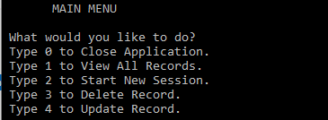
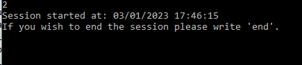
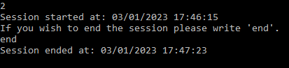
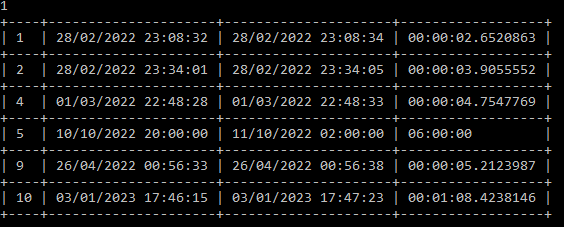

# Coding-Tracker

Second console application in a series for learning .net. 

Application is meant for keeping track of pushups done every day

## Requirements: 
 - [x] This application has the same requirements as the [previous project](https://github.com/Walter4B/Habit-Tracker), except that now you'll be logging your daily coding time.
 - [x] To show the data on the console, you should use the "ConsoleTableExt" library.
 - [x] You're required to have separate classes in different files (ex. UserInput.cs, Validation.cs, CodingController.cs)
 - [x] You should tell the user the specific format you want the date and time to be logged and not allow any other format.
 - [x] You'll need to create a configuration file that you'll contain your database path and connection strings.
 - [x] You'll need to create a "CodingSession" class in a separate file. It will contain the properties of your coding session: Id, StartTime, EndTime, Duration
 - [x] The user shouldn't input the duration of the session. It should be calculated based on the Start and End times, in a separate "CalculateDuration" method.
 - [x] The user should be able to input the start and end times manually.
 - [x] When reading from the database, you can't use an anonymous object, you have to read your table into a List of Coding Sessions.

## Features
- SQLite database connection
  - The program uses a SQLite db connection to store and read information.
  - If database or table do not exist they will be crated on startup.

- Console main menu
  - 

- CRUD db functions 
  - In the main menu user can create, read, update and delete entries
  - Date and time is taken on session start and session end
  - 
  - When the session is ended duration is calculated and all the data is added to the database
  - 

- Reporting is done with IDs so user can use the app as intended
  - 
  - "ConsoleTableExt" library was used for table display

- This project was also used to learn [unit testing](https://github.com/Walter4B/Coding-Tracker/tree/master/CodingTracker.UnitTests) 

## Tech stack:
- Sqlite database 
- Sqlite data reader
- SQL
- .net 6.0

Special thanks to [Cappuccinocodes](https://github.com/cappuccinocodes) for help and advice.
